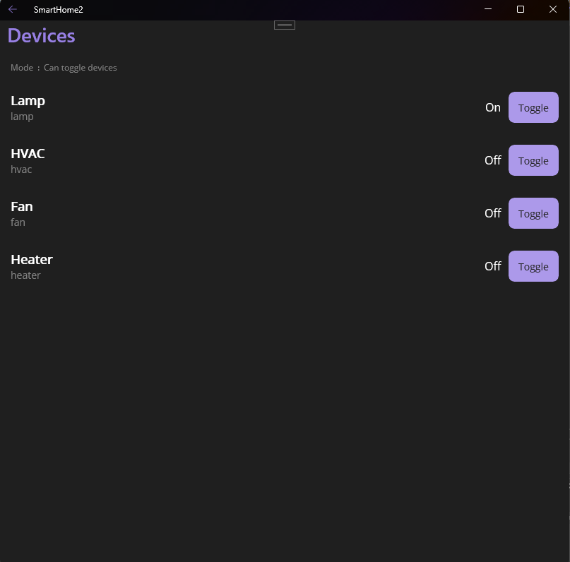

# 🏠 SmartHome - .NET MAUI Smart Home Client

[](https://dotnet.microsoft.com/apps/maui)
[](https://docs.microsoft.com/dotnet/csharp/)
[](https://mqtt.org/)
[](LICENSE)

Cross-platform smart home monitoring and control application built with .NET MAUI, featuring real-time MQTT updates and HTTP API integration..

Backend Server - FastAPI backend repository: [alex827a/smart-home-backend](https://github.com/alex827a/smart-home-backend.git)

---

- **🔐 SSE Authentication**: Basic Authentication support for SSE fallback mode
- **👥 Role-Based Access**: Separate permissions for guest (read-only) and admin (full control)
- **🔒 Secure API**: All API endpoints now require authentication
- **⚡ Auto-Reconnect**: Automatic reconnection with proper credential handling

---

## 📋 Table of Contents

- [🚀 Quick Start](#quick-start)
- [⚡ Features](#features)
- [🖼️ Screenshots](#screenshots)
- [🧩 Architecture](#architecture)
- [🛠️ Prerequisites](#prerequisites)
- [⚙️ Configuration](#configuration)
- [🚀 Usage](#usage)
- [🗂️ Project Structure](#project-structure)
- [📄 License](#license)

---
## Quick Start

1️⃣ Install prerequisites (Windows only once)

.NET 8 Desktop Runtime

Microsoft Windows App Runtime 1.5 x64

Python 3.10 or higher


---

2️⃣ Run the Backend Server

Clone or download the backend repo → https://github.com/alex827a/smart-home-backend.git

Then choose one of two ways to launch it:


🔹 Option A — Simple mode (no MQTT, for quick test)

   ```bash
   
     python run_server.py
   
   ```

Server starts on http://127.0.0.1:8001

✅ Works via REST and SSE (fallback realtime).

🔹 Option B — Full mode (MQTT + TLS)

   ```bash
   
     .\start_server_with_mqtt_tls.ps1
   
   ```


  Requires Mosquitto and local certificates (see [SmartHome Integration Guide](https://github.com/alex827a/smart-home-backend/blob/main/SMART_HOME_INTEGRATION.md)).

  Starts FastAPI on port 8001 and MQTT on 8883 / 8884.

  Use admin/guest accounts as defined in ACL.


---

3️⃣ Run the MAUI Client

1. Download latest build → 📦 [SmartHome2-win-x64.zip](https://github.com/alex827a/smart-home-client-maui/releases)


2. Unzip and run SmartHome2.exe


3. In Settings set:

Backend URL = http://127.0.0.1:8001
MQTT Host   = localhost
MQTT Port   = 8883
Use MQTT    = ON (optional)


4. Login as:

admin / admin123 (Full access)

guest / 123 (Read-only)


---

4️⃣ Verify

Open browser: http://127.0.0.1:8001/docs → Swagger UI available.

In app: devices list updates, metrics change live (if MQTT connected).

If MQTT is offline → app switches to SSE fallback mode (REST only).


---

⚙️ Notes

Port Service Description

8001 FastAPI Backend REST + SSE
8883 MQTT TLS Secure connection (admin)
8884 MQTT TLS (no cert) Guest mode (optional)


Firewall: allow TCP 8001 / 8883 / 8884.
Certificates: not included in repo → generate via mkcert.
## Features

### 📟 Real-time Monitoring
- **Live Metrics Dashboard**: Temperature, Humidity, Power consumption
- **MQTT Push Notifications**: Instant updates without polling
- **SSE Fallback Mode**: Automatic fallback to Server-Sent Events when MQTT unavailable
- **Authenticated SSE**: Secure SSE connection with Basic Authentication
- **Historical Charts**: Interactive LiveCharts with configurable data points
- **Offline Support**: SQLite caching for offline operation

### 🕹️ Device Control
- **Remote Device Management**: Toggle smart home devices (lights, fans, HVAC, etc.)
- **Role-Based Access Control**: Admin and Guest user roles
- **Permission Enforcement**: Guest users have read-only access
- **Visual Feedback**: Real-time device state updates

### 🌐 Internationalization
- **Multi-language Support**: English and German 
- **Dynamic Language Switching**: Change language without app restart
- **Localized UI**: All screens fully translated

### 🔒 Security & Resilience
- ** HTTP Basic Authentication**: Secure API access with username/password
- **SSE Authentication**: Protected SSE stream with role validation
- **MQTT TLS/SSL**: Encrypted communication with broker
- **Client Certificates**: mTLS authentication support (optional)
- **ACL Integration**: Mosquitto ACL enforcement
- **Automatic Fallback**: Seamless switch to SSE when MQTT unavailable
- **Secure Credentials**: Persistent credential storage


## Screenshots

- **Login Page**  
  

- **Dashboard**  
  

- **Devices List**  
  

- **Metrics / Charts**  
  

- **Settings**  
  
## Architecture

```
+-----------------------------+        +-----------------------------+
|    MAUI UI (Views, XAML)    |<------>|      ViewModels (MVVM)      |
+-----------------------------+        +-----------------------------+
            |                                   |
            v                                   v
+-----------------------------+        +-----------------------------+
|        Services Layer        |<------>|   Utils / Converters       |
| (RealtimeService, ApiClient,|        +-----------------------------+
|  MqttService, SseService,   |
|  SqliteDataStore, etc.)     |
+-----------------------------+
            |
            v
+-----------------------------+
|        Data Layer           |
|   (Local SQLite, DTOs)      |
+-----------------------------+
            |
            v
+-----------------------------+
|   Backend & Integrations    |
|  - FastAPI Server (HTTP)    |
|  - Mosquitto MQTT (optional)|
|  - SSE Stream (fallback)    |
+-----------------------------+
```

**Layer Descriptions:**

- **MAUI UI**: User interface built with XAML pages.
- **ViewModels (MVVM)**: Presentation logic, binds UI to business logic.
- **Services Layer**: 
  - **RealtimeService**: Unified real-time service with automatic MQTT/SSE fallback
  - **MqttService**: MQTT client for primary real-time updates
  - **SseService**: Server-Sent Events client for fallback mode
  - **ApiClient**: HTTP API client with Polly resilience policies
  - **SqliteDataStore**: Local caching and offline support
- **Utils / Converters**: Helpers for data formatting and UI binding.
- **Data Layer**: Local storage and data transfer objects (DTOs).
- **Backend & Integrations**: 
  - **FastAPI server**: RESTful API and SSE stream endpoint
  - **Mosquitto**: Optional MQTT broker for low-latency real-time updates
  - **SSE fallback**: Server-Sent Events for guest mode when MQTT unavailable

**Connection Modes:**

1. **MQTT Mode** (Primary): Direct MQTT connection for fastest updates (~10ms latency)
2. **SSE Mode** (Fallback): HTTP-based Server-Sent Events when MQTT unavailable (~100ms latency)
3. **Offline Mode**: Cached data from SQLite when no connection available
---


### Technology Stack

| Component | Technology | Version |
|-----------|-----------|---------|
| **Framework** | .NET MAUI | 8.0 |
| **Language** | C# | 12.0 |
| **MVVM** | CommunityToolkit.Mvvm | 8.2.2 |
| **Database** | SQLite (sqlite-net-pcl) | 1.9.172 |
| **HTTP Client** | Polly (Resilience) | 8.0.10 |
| **MQTT** | MQTTnet | 4.3.7.1207 |
| **SSE** | Built-in HttpClient | .NET 8 |
| **Charts** | LiveChartsCore | 2.0.0-rc3.3 |
| **UI** | SkiaSharp | Latest |

---

## Prerequisites

### Required Software

1. **Visual Studio 2022** (v17.8 or later)
   - Workload: `.NET Multi-platform App UI development`
   - OR **Visual Studio Code** with C# Dev Kit extension

2. **.NET 8.0 SDK**
   ```bash
   # Check if installed
   dotnet --version
   # Should return 8.0.x or higher
   ```
   Download: https://dotnet.microsoft.com/download/dotnet/8.0

3. **Platform-specific SDKs** (optional, for deployment)
   - **Windows**: Windows 10.0.19041.0 SDK or higher
   - **Android**: Android SDK 21+ (included in VS)
   - **iOS/macOS**: Xcode 15+ (macOS only)

### Backend Services

4. **FastAPI Server** (Python) - **Required**
   - Repository: https://github.com/alex827a/smart-home-backend.git
   - Default URL: `http://127.0.0.1:8000`
   - **Authentication**: All endpoints require Basic Auth
   - **Required endpoints:**
     - `GET /api/metrics` - Metrics data (🔒 authenticated)
     - `GET /api/devices` - Device list (🔒 authenticated)
     - `POST /api/devices/{id}/toggle` - Device control (🔒 admin only)
     - `GET /api/status` - Server status (public)
     - `GET /api/events/stream` - SSE fallback stream (🔒 authenticated)

5. **Mosquitto MQTT Broker** - **Optional** (fallback to SSE if unavailable)
   - Version: 2.0.18+
   - Port: 8883 (TLS) or 1883 (non-TLS)
   - Download: https://mosquitto.org/download/
   - **Note**: App automatically uses SSE fallback if Mosquitto is not running

## Configuration

### 1. Backend Server Setup

FastAPI backend repository: [alex827a/smart-home-backend](https://github.com/alex827a/smart-home-backend.git)

** Set up environment variables:**
```bash
# Guest user credentials (read-only)
export GUEST_PASSWORD="123"

# Admin user credentials (full access)
export ADMIN_PASSWORD="admin123"
```

Ensure your FastAPI server is running:
```bash
cd /path/to/fastapi-server
uvicorn main:app --reload --host 0.0.0.0 --port 8000
```

**Authentication Required:**
All API endpoints now require Basic Authentication. The client automatically sends credentials using the username/password from the login screen.

**Required API Endpoints:**
- `GET /api/metrics` - Returns current sensor metrics (🔒 guest/admin)
- `GET /api/devices` - Returns list of devices (🔒 guest/admin)
- `POST /api/devices/{id}/toggle` - Toggles device state (🔒 admin only)
- **`GET /api/status`** - Returns MQTT broker availability status (public)
- **`GET /api/events/stream`** - SSE endpoint for real-time updates (🔒 guest/admin)

**Example `/api/status` response:**
```json
{
  "mqtt_available": false,
  "mqtt_broker": "127.0.0.1",
  "mqtt_port": 8883,
  "recommended_mode": "sse",
  "sse_clients_count": 1,
  "timestamp": "2024-01-15T14:30:00"
}
```

**SSE Authentication:**
SSE endpoint requires Basic Authentication:
```bash
# Example: Connect as guest
curl -u guest:123 -N http://127.0.0.1:8000/api/events/stream
```

**SSE Stream Format:**
```
data: {"topic":"system/connection","payload":{"status":"connected","user":"guest","role":"guest"},"timestamp":"..."}\n\n
data: {"topic":"home/system/metrics","payload":{...},"timestamp":"..."}\n\n
data: {"topic":"home/lamp/state","payload":{...},"timestamp":"..."}\n\n
```

### 2. Mosquitto Broker Setup (Optional)

**Note**: The app automatically falls back to SSE mode if Mosquitto is unavailable.
You can run the app without MQTT broker - it will use HTTP Server-Sent Events instead

## Usage

### Login

1. Launch the application
2. Select language: **EN** / **DE**
3. ** Authentication Required**: Enter credentials or use Quick Login
4. Login options:
   - **Quick Login**: Tap "Guest" or "Admin" buttons
   - **Manual**: Enter credentials
   - ** Note**: Invalid credentials will result in connection failure

| User  | Username | Password | Permissions                       | Fallback Mode |
|-------|----------|----------|-----------------------------------|---------------|
| Guest | `guest`  | `123`    | View only (metrics, devices)      | ✅ SSE supported (🔒 authenticated) |
| Admin | `admin`  | `admin123` | Full control (toggle devices, settings) | ✅ SSE supported (🔒 authenticated) |

**Permission Differences:**
- **Guest**: Can view metrics and device status, but **cannot** toggle devices (403 Forbidden)
- **Admin**: Full access to all features including device control

**Connection Modes:**
- 🟢 **MQTT Mode**: `Connection: Connected (MQTT)` - Full speed, ~10ms latency
- 🟡 **SSE Mode**: `Connection: Connected (SSE)` - Fallback, ~100ms latency (🔒 authenticated)
- 🔴 **Offline**: Uses cached data from SQLite

### Dashboard

- View real-time metrics (Temperature, Humidity, Power)
- See connection status and current mode (MQTT/SSE)
- User Role Display: Shows current user role (Guest/Admin)
- MQTT connection status indicator
- Navigate to:
  - **Open Devices**: Control smart devices (admin) or view status (guest)
  - **View Charts**: Historical data visualization
  - **Settings**: App configuration (Admin only)

## Project Structure

```
SmartHome2/
├── Models/                  # Data models (DTOs)
│   └── Dtos.cs              # MetricsDto, DeviceDto
├── Services/                # Business logic
│   ├── RealtimeService.cs   #  Unified service with MQTT/SSE fallback
│   ├── MqttService.cs       # MQTT client (MQTTnet)
│   ├── SseService.cs        #  SSE client for fallback mode
│   ├── ApiClient.cs         # HTTP API client (Polly)
│   ├── SqliteDataStore.cs   # Local database (SQLite)
│   ├── AppSettings.cs       # Configuration (Preferences)
│   └── IApiClient.cs        # Service interfaces
├── ViewModels/              # MVVM ViewModels
│   ├── DashboardVm.cs       # Dashboard logic (uses RealtimeService)
│   ├── DevicesVm.cs         # Device control
│   ├── ChartsVm.cs          # Charts data binding
│   ├── LoginVm.cs           # Authentication (auto guest mode)
│   └── SettingsVm.cs        # Configuration
├── Views/                   # XAML UI pages
│   ├── LoginPage.xaml       # Login screen (shows fallback banner)
│   ├── DashboardPage.xaml   # Main dashboard (shows connection mode)
│   ├── DevicesPage.xaml     # Device list
│   ├── ChartsPage.xaml      # Charts visualization
│   └── SettingsPage.xaml    # Settings screen
├── Resources/               # Assets
│   ├── Strings/             # Localization
│   │   └── AppResources.cs  # EN/DE translations
│   ├── Images/              # Images/icons
│   └── Styles/              # XAML styles
├── Utils/                   # Helper classes
│   ├── BoolToOnOffConverter.cs # XAML converters
│   └── BoolToModeConverter.cs
├── docs/                    #  Documentation   
│   ├── CONFIGURATION.md     # Configuration guide
├── Platforms/               # Platform-specific code
│   ├── Windows/
│   ├── Android/
│   └── iOS/
├── MauiProgram.cs           # DI container setup
├── App.xaml.cs              # Application entry point
├── AppShell.xaml            # Navigation shell
├── SmartHome2.csproj        # Project file
└── README.md                # This file

```


##  Security Note
### Important for Production

1. **Use HTTPS**: Always use HTTPS in production to protect credentials in transit
   ```bash
   uvicorn main:app --ssl-keyfile key.pem --ssl-certfile cert.pem
   ```

2. **Strong Passwords**: Change default passwords:
   ```bash
   export GUEST_PASSWORD="your-strong-guest-password"
   export ADMIN_PASSWORD="your-strong-admin-password"
   ```

3. **Rate Limiting**: Add rate limiting to prevent brute-force attacks

4. **JWT Tokens**: For production, consider using JWT tokens instead of Basic Auth

### Current Implementation (Development)

- **Basic Authentication**: Username/password sent with each request
- **No Token Storage**: Credentials stored in `AppSettings` (Preferences)
- **HTTP Support**: Works over HTTP (use HTTPS in production)
- **Default Credentials**: Guest (guest:123), Admin (admin:admin123)

---

## License

This project is licensed under the MIT License - see the [LICENSE](LICENSE) file for details.

---
